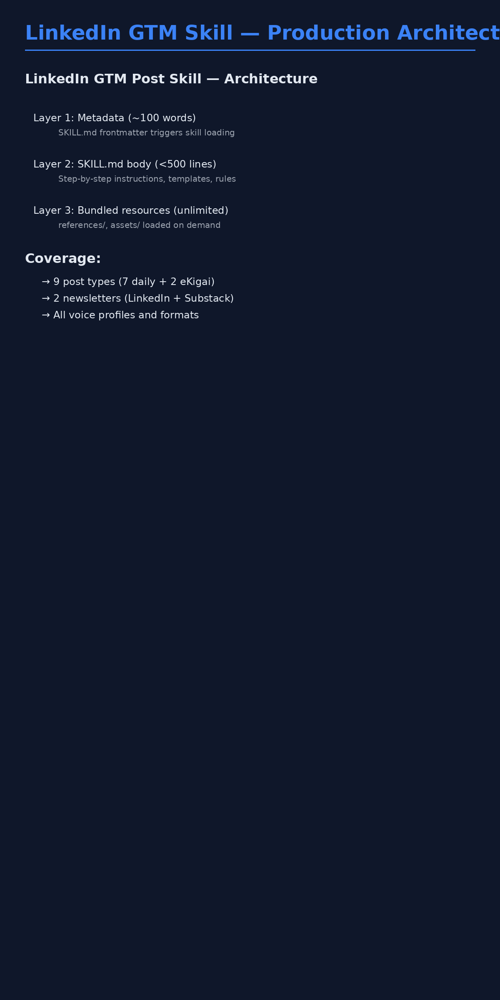

# LinkedIn GTM Post Production Skill

**Complete content creation system for Karthikeyan's LinkedIn GTM strategy**

---

## 📦 What's Included

This skill package contains everything needed to create high-quality LinkedIn content across all 9 weekly post types + 2 newsletters.

### File Structure

```
linkedin-gtm-skill/
├── SKILL.md                                    ← Main skill file (load this in Claude)
├── linkedin-gtm-skill-architecture.gif         ← Visual architecture diagram
├── references/
│   ├── tone-guide.md                          ← Voice profiles for each post type
│   ├── post-formats.md                        ← Templates for all 9 posts + newsletters
│   └── examples.md                            ← 10+ annotated high-performing examples
└── assets/
    └── (empty - for future emoji palettes, images, etc.)
```

---

## 🎯 Coverage

### 9 Weekly Post Types

**Daily Educational Posts (7x/week):**
1. **Monday 8 AM:** GTM Engineering Execution (client work showcase)
2. **Tuesday 8 AM:** Product Marketing Strategy (frameworks)
3. **Wednesday 8 AM:** GTM Engineering Execution (tool integration)
4. **Thursday 8 AM:** LinkedIn Foundation (growth strategy)
5. **Friday 8 AM:** Claude/Agentic Evaluation (AI quality)
6. **Saturday 8 AM:** Product Development (build decisions)
7. **Sunday 8 AM:** Weekly Showcase + Analytics (results)

**eKigai Product Posts (2x/week):**
8. **Tuesday 6 PM:** Building eKigai (product development insights)
9. **Thursday 6 PM:** eKigai User Story (social proof)

**Newsletters (2):**
10. **Production GTM** (LinkedIn, Sunday 10 AM) - Technical GTM engineering
11. **The AI Product Marketer** (Substack, Wednesday 8 AM) - Strategic PM frameworks

---

## 🚀 How to Use

### Quick Start

**In Claude:**
```
Write a [Monday/Tuesday/etc.] LinkedIn post about [topic]
```

**Examples:**
- "Write a Monday GTM Execution post about automated ICP scoring"
- "Draft Tuesday PM eKigai post about real-time funding signals"
- "Create Production GTM newsletter on signal detection framework"

### The Skill Will:

1. **Identify post type** (Monday execution vs Tuesday PM eKigai vs newsletter)
2. **Load appropriate references:**
   - Voice profile from `tone-guide.md`
   - Template from `post-formats.md`
   - Examples from `examples.md` if needed
3. **Draft the post:**
   - Hook (pattern interrupt, under 20 words)
   - Body (follows template structure)
   - CTA (matches post type and goal)
4. **Quality check:**
   - Hook strength
   - Specificity
   - Voice consistency
   - Brand alignment
5. **Output formatted post:**
   - Full post text with formatting
   - Character count
   - Target audience
   - Best posting time
   - Quality checklist
   - Optimization suggestions

---

## 📋 Key Features

### Voice Profiles (5 Types)

1. **Technical Authority** (Mon/Wed/Fri execution posts)
   - Engineer-to-engineer
   - Data-driven, specific
   - "Here's what we built and how"

2. **Strategic Consultant** (Tue AM/Sat product marketing)
   - Framework-oriented
   - Business value focus
   - "Here's how we think about X"

3. **Build-in-Public Founder** (Tue PM/Thu PM eKigai)
   - Founder-to-founder
   - Educational first (70-20-10 rule)
   - "Here's what we're learning"

4. **LinkedIn Practitioner** (Thu AM foundation)
   - Meta, tactical
   - "I tested X, here's what happened"

5. **Data Storyteller** (Sun showcase)
   - Reflective, numbers + narrative
   - "Here's what we learned this week"

### Content Templates

**All 9 post types have:**
- Specific hook patterns
- Body structure template
- CTA strategies
- Formatting guidelines
- Length targets
- Hashtag strategies

**Both newsletters have:**
- Full edition structure
- Section templates
- Lead magnet integration
- Length guidelines (1.2K-1.8K LinkedIn, 2K-3K Substack)

### Quality Gates

**Every post is checked for:**
- ✅ Hook quality (specific, under 20 words, pattern interrupt)
- ✅ Body specificity (metrics, examples, not vague)
- ✅ Voice consistency (matches post type)
- ✅ CTA appropriateness (education vs product)
- ✅ Formatting (arrows, line breaks, 3-5 hashtags)
- ✅ Brand alignment (AI GTM Engineer at e-ideaCS)

---

## 🎨 Visual Architecture



**3-Layer Architecture:**

**Layer 1: Metadata (~100 words)**
- SKILL.md frontmatter
- Trigger keywords
- Claude reads this to decide whether to load skill

**Layer 2: SKILL.md body (<500 lines)**
- Step-by-step instructions
- Output templates
- Tone guidance
- Quality rules

**Layer 3: Bundled resources (unlimited)**
- `references/tone-guide.md` - Voice profiles
- `references/post-formats.md` - All templates
- `references/examples.md` - Annotated examples
- Loaded on demand when SKILL.md references them

---

## 📊 Special Rules

### eKigai Posts (70-20-10 Rule)

Critical for Tuesday PM and Thursday PM posts:

- **70% Educational:** Lead with learning/insight, share GTM engineering approach
- **20% Product Context:** Mention eKigai as case study, not promotion
- **10% Soft CTA:** Invitation, not pressure ("Testing with 50+ founders. Want early access?")

**Never say:**
- ❌ "eKigai is the best GTM tool"
- ❌ "Limited time offer"
- ❌ "Sign up now before prices increase"

**Always say:**
- ✅ "Here's what we learned building eKigai's X feature"
- ✅ "Testing this approach with 50 founders"
- ✅ "Building in public: what worked and didn't"

### Hook Patterns by Type

**Educational posts:**
"Most [ICP] waste [X hours/week] on [problem]. Here's how to fix it:"

**eKigai Building posts:**
"Building eKigai: [Feature]. [Founder pain point eKigai solves]. Here's how we're solving it:"

**eKigai User Story posts:**
"[Founder name] was [pain point]. After eKigai: [specific result with metric]."

**Weekly showcase:**
"Weekly Showcase: [Theme]. This week: [3 systems], [X hours saved]. Here's the breakdown:"

---

## 💡 Examples Included

The skill includes 10+ fully annotated examples:

1. **Monday:** Automated ICP Scoring (2.4K impressions, 5.8% engagement)
2. **Tuesday AM:** 3-Layer ICP Framework (1.8K impressions, 6.2% engagement)
3. **Tuesday PM:** Real-Time Funding Signals (1.6K impressions, 12 waitlist signups)
4. **Thursday PM:** Sarah's ICP Automation (1.4K impressions, 8 demo bookings)
5. **Friday:** Personalization Quality Testing (1.9K impressions, 6.1% engagement)
6. **Sunday:** GTM Automation Sprint (2.1K impressions, 5.2% engagement)
7. **Newsletter:** Signal Detection Framework (52% open rate, 14% click rate)

Each example shows:
- ✅ Why the hook works
- ✅ Why the structure works
- ✅ Why the CTA converts
- ❌ What could be improved

---

## 🔧 Advanced Usage

### Creating Variants

**Request specific formats:**
```
Write a Monday post about ICP scoring.
Create 3 variants:
1. Short version (200-300 words)
2. Long version (400-600 words)
3. Carousel version (10 slides)
```

### Newsletter Editions

**Request newsletter format:**
```
Create Production GTM newsletter edition on signal detection.
Include:
- Architecture section with system diagram
- Implementation with code snippets
- Results from client work
- Lead magnet: Signal Taxonomy Template
```

### Custom Adaptations

**Override defaults:**
```
Write Tuesday PM eKigai post about funding signals.
Make it more technical (70% technical, 20% product, 10% CTA).
Target AI engineers, not founders.
```

---

## 📈 Success Metrics

Posts created with this skill targeting:

**Engagement rates:**
- Educational posts: 4-6%
- eKigai product posts: 4-8%
- Weekly showcase: 5-7%

**eKigai conversion:**
- Tuesday PM Building posts: 8-15 waitlist signups/post
- Thursday PM User Story: 5-10 demo bookings/post

**Newsletter performance:**
- Production GTM: 50-55% open rate, 12-15% click rate
- AI Product Marketer: 55-60% open rate, 15-18% click rate

---

## 🎯 Positioning Rules

**Always reference:**
- AI GTM Engineer **at e-ideaCS** (not solo)
- "We work with clients" OR "I work with the team" (not "I build")
- eKigai mentioned appropriately (only Tue/Thu PM posts)
- Newsletter CTAs where relevant

**Never say:**
- "I'm excited to share..." (generic)
- "Revolutionary" / "Game-changing" (hype)
- Generic corporate speak
- Humble bragging

---

## 📝 Installation

### Option 1: Use Directly in Claude

Upload `SKILL.md` to Claude and say:
```
Use the linkedin-gtm-post skill to write a [post type] about [topic]
```

### Option 2: Reference Files

If Claude has file access:
```
Read /path/to/linkedin-gtm-skill/SKILL.md
Then write a Monday post about ICP scoring
```

---

## 🔄 Updates

**Version:** 1.0  
**Last Updated:** March 2026  
**Coverage:** All 9 post types + 2 newsletters

**Changelog:**
- v1.0 (March 2026): Initial release with all 9 post types, 2 newsletters, complete reference library

---

## 📞 Support

**Questions about the skill?**
- Review `references/examples.md` for annotated examples
- Check `references/tone-guide.md` for voice guidance
- See `references/post-formats.md` for all templates

**Want to extend the skill?**
- Add new examples to `references/examples.md`
- Update templates in `references/post-formats.md`
- Customize voice profiles in `references/tone-guide.md`

---

## ✅ Quick Checklist

Before using the skill, ensure:
- [ ] You know which post type you're writing (Monday/Tuesday/etc.)
- [ ] You have a specific topic (not vague)
- [ ] You know the goal (educational, social proof, product promotion)
- [ ] You have any required data (metrics, client stories, etc.)

After generating a post, verify:
- [ ] Hook is specific and under 20 words
- [ ] Body includes real metrics/examples
- [ ] Voice matches post type
- [ ] CTA is appropriate (not too pushy)
- [ ] Formatting follows guidelines (arrows, line breaks, hashtags)

---

**Ready to create LinkedIn content that builds authority, drives users, and positions you for promotion.**

**Load SKILL.md in Claude and start creating.** 🚀
